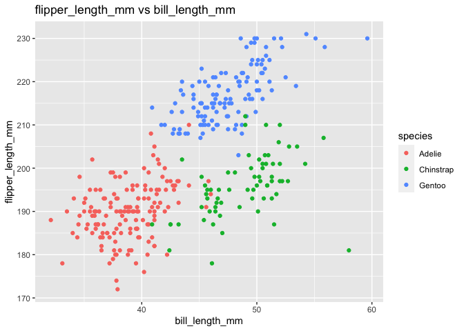

p8105\_hw1\_yc4018.Rmd
================
Yuxuan Chen

# Problem 1:

``` r
set.seed(1)
library(tidyverse)
problem1_df = 
  tibble(
    norm_samp = rnorm(10, mean = 0, sd = 1), #random sample (size 10) from standard Normal distribution
    norm_samp_pos = norm_samp > 0, #logical vector indicating whether elements of the sample are greater than 0
    character_vector = vector("character", length = 10), #a character vector of length 10
    factor_vector = factor(c("a","a","a","b","b","b","b","c","c","c")) 
        #a factor vector of length 10, with 3 different factor “levels”
  )

problem1_df
```

    ## # A tibble: 10 × 4
    ##    norm_samp norm_samp_pos character_vector factor_vector
    ##        <dbl> <lgl>         <chr>            <fct>        
    ##  1    -0.626 FALSE         ""               a            
    ##  2     0.184 TRUE          ""               a            
    ##  3    -0.836 FALSE         ""               a            
    ##  4     1.60  TRUE          ""               b            
    ##  5     0.330 TRUE          ""               b            
    ##  6    -0.820 FALSE         ""               b            
    ##  7     0.487 TRUE          ""               b            
    ##  8     0.738 TRUE          ""               c            
    ##  9     0.576 TRUE          ""               c            
    ## 10    -0.305 FALSE         ""               c

``` r
num_vecter = pull(problem1_df, norm_samp)
logical_vecter = pull(problem1_df, norm_samp_pos)
character_vecter = pull(problem1_df, character_vector)
facter_vector = pull(problem1_df, factor_vector)

mean(num_vecter)
## [1] 0.1322028
mean(logical_vecter)
## [1] 0.6
mean(character_vecter)
## Warning in mean.default(character_vecter): argument is not numeric or logical:
## returning NA
## [1] NA
mean(facter_vector)
## Warning in mean.default(facter_vector): argument is not numeric or logical:
## returning NA
## [1] NA
```

-   After trying to take the mean of each variable in the dataframe, the
    numeric variables and logical variables work since they have
    arithmetic values. The logical variables have 1 for True and 0 for
    False. However, the character variables and factor variables do not,
    since they are not numeric or logical.

``` r
as.numeric(logical_vecter) #apply the as.numeric function to the logical variables
as.numeric(character_vecter)  #apply the as.numeric function to the character variables
as.numeric(facter_vector) #apply the as.numeric function to the factor variables
```

-   After applying the as.numeric function, the logical and factor
    variables are converted to the numeric; and the character variables
    are unable to converted to numeric. The logical variables will be
    converted to 1 for True and 0 for False. And the factor variables
    will return the underlying numeric (integer) representation. This is
    because as.numeric attempts to coerce its argument to the numeric
    type, which is often meaningless since it may not correspond to the
    factor levels.

-   The as.numeric function help explain what happens for logical
    variables when trying to take their mean since we can know the ratio
    of True to False from the result. The as.numeric function also helps
    explain what happens for character variables when trying to take
    their mean. Since character variables are not numeric and cannot be
    converted to numeric, their mean will be shown as NA. However, since
    as.numeric function converts its argument to numeric regardless the
    factor levels, it does not help explain what happens for factor
    variables when trying to take their mean.

------------------------------------------------------------------------

# Problem 2:

``` r
# the data in this dataset
data("penguins", package = "palmerpenguins")
penguins
## # A tibble: 344 × 8
##    species island    bill_length_mm bill_depth_mm flipper_length_mm body_mass_g
##    <fct>   <fct>              <dbl>         <dbl>             <int>       <int>
##  1 Adelie  Torgersen           39.1          18.7               181        3750
##  2 Adelie  Torgersen           39.5          17.4               186        3800
##  3 Adelie  Torgersen           40.3          18                 195        3250
##  4 Adelie  Torgersen           NA            NA                  NA          NA
##  5 Adelie  Torgersen           36.7          19.3               193        3450
##  6 Adelie  Torgersen           39.3          20.6               190        3650
##  7 Adelie  Torgersen           38.9          17.8               181        3625
##  8 Adelie  Torgersen           39.2          19.6               195        4675
##  9 Adelie  Torgersen           34.1          18.1               193        3475
## 10 Adelie  Torgersen           42            20.2               190        4250
## # … with 334 more rows, and 2 more variables: sex <fct>, year <int>
names(penguins)
## [1] "species"           "island"            "bill_length_mm"   
## [4] "bill_depth_mm"     "flipper_length_mm" "body_mass_g"      
## [7] "sex"               "year"
#the size of the dataset
row = nrow(penguins) #number of rows
column = ncol(penguins) #number of rows

#the mean flipper length
sum(is.na(penguins$flipper_length_mm))
## [1] 2
mean = mean(pull(penguins, flipper_length_mm),na.rm = TRUE) #exclude NA values and calculate mean for non-missing values
```

-   Hence, the names included in this “penguins” datasets are: species,
    island, bill\_length\_mm, bill\_depth\_mm, flipper\_length\_mm,
    body\_mass\_g, sex, year. And this dataset contains 344 rows and 8
    columns. After excluding the NA values, the mean of flipper length
    is 200.9152047 mm.

-   Since bill\_length\_mm, bill\_depth\_mm, flipper\_length\_mm, and
    body\_mass\_g are important variables, the mean values of these
    variables are calculated in below R chunk.

``` r
mean_billlength = mean(pull(penguins, bill_length_mm),na.rm = TRUE) 
mean_billdepth = mean(pull(penguins, bill_depth_mm),na.rm = TRUE) 
mean_flipperlength = mean(pull(penguins, flipper_length_mm),na.rm = TRUE) 
mean_bodymass = mean(pull(penguins, body_mass_g),na.rm = TRUE) 
```

-   Hence, the mean of bill\_length\_mm is 43.9219298, mean of
    bill\_depth\_mm is 17.1511696, mean of flipper\_length\_mm is
    200.9152047, and the mean of body\_mass\_g is 4201.754386.

``` r
#scatterplot of flipper_length_mm (y) vs bill_length_mm (x); 

ggplot(penguins, aes(x = bill_length_mm, y = flipper_length_mm, 
                     color = species)) + geom_point() + labs(title = "flipper_length_mm vs bill_length_mm")
```

<!-- -->

``` r
ggsave("./scatterplot.pdf", height = 5, width = 6)
```
